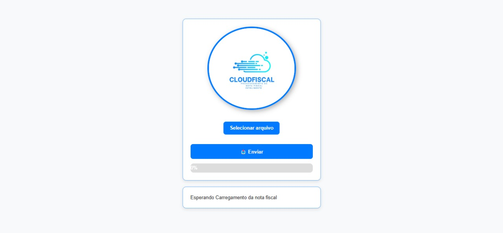
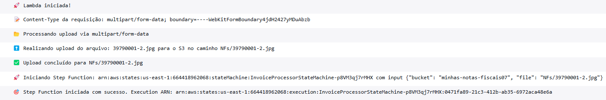
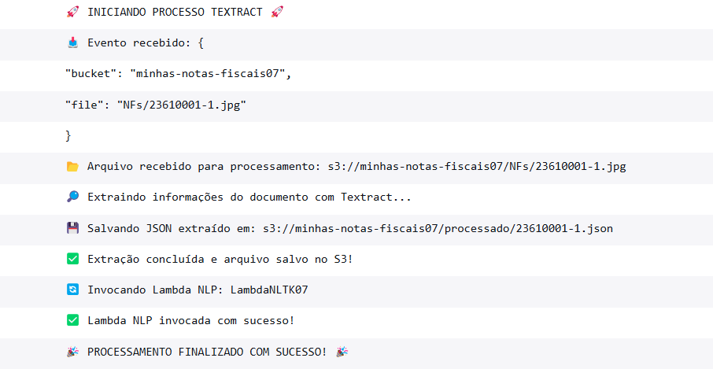
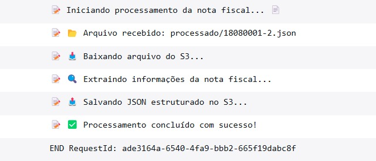
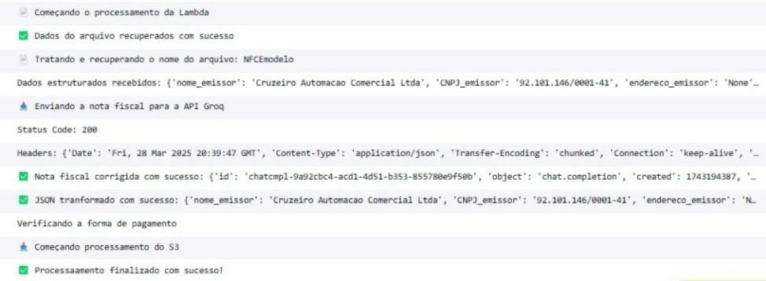
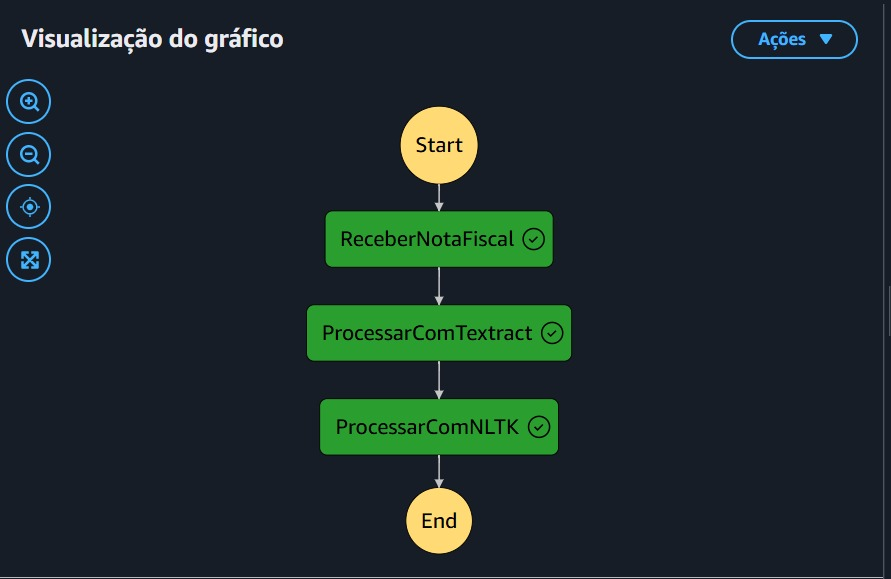
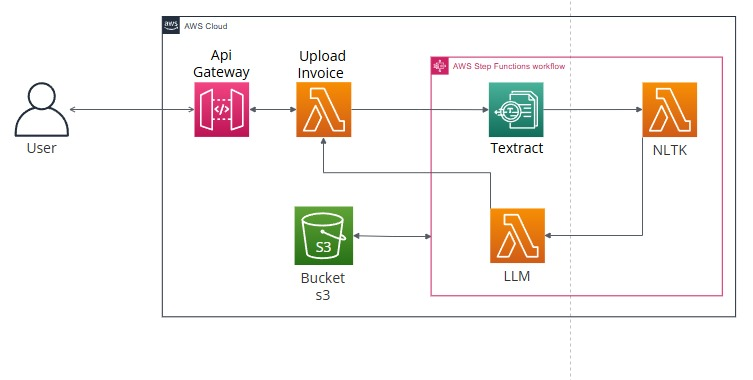

<div align="justify">

# 🧾 CLOUDFISCAL - Processamento de Notas Fiscais

<div align="center">
  
</div>

##  Visão Geral

Este projeto implementa um sistema automatizado para processamento de notas fiscais, utilizando serviços da Amazon AWS para extrair, processar e estruturar informações de forma eficiente. A arquitetura é baseada em AWS Lambda, API Gateway, S3, Textract, NLTK e Step Functions, garantindo escalabilidade e automação do fluxo de trabalho.

O principal objetivo é extrair, processar e organizar os dados das notas fiscais enviadas pelos usuários, transformando-os em um formato estruturado para facilitar análises.


Link para o acesso: http://cloudfiscalv1.1.s3-website-us-east-1.amazonaws.com

 
[](https://developer.mozilla.org/en-US/docs/Web/HTML)
[](https://developer.mozilla.org/en-US/docs/Web/CSS)
[](https://developer.mozilla.org/en-US/docs/Web/JavaScript)
[](https://aws.amazon.com/s3/)
[](https://aws.amazon.com/step-functions/)
[](https://aws.amazon.com/cloudwatch/)
[](https://aws.amazon.com/lambda/)
[](https://aws.amazon.com/textract/)
[](https://www.nltk.org/)
[-FFD700?style=for-the-badge&logo=huggingface&logoColor=black)](https://llama.meta.com/)
[](https://boto3.amazonaws.com/v1/documentation/api/latest/index.html)
[](https://www.docker.com/)


---
### 🔒 Disponibilidade da Aplicação

> **Nota:** Este projeto foi finalizado e teve seus recursos em nuvem desativados para evitar custos adicionais com serviços AWS (S3, Lambda, API Gateway, etc).  
> Portanto, o link de demonstração não está mais disponível.

Para executar este projeto novamente, basta seguir os passos da seção [Deployment](#Deployment) e configurar os recursos necessários na AWS com o AWS SAM.

## 📖 Índice

1. [🚀 Tecnologias Utilizadas](#-tecnologias-utilizadas)
2. [🖥️ Demonstração da Interface](#-demonstração-da-interface)
3. [📋 Pré-requisitos](#-pré-requisitos) 
4. [🏗️ Arquitetura do Sistema](#-arquitetura-do-sistema)
5. [🔄 Fluxo de Orquestração](#-fluxo-de-orquestração)
6. [📊 Diagrama da Aplicação](#-diagrama-da-aplicação)
7. [🛠️ Configuração e Execução](#-configuração-e-execução)
8. [📦 Deployment](#-deployment)
9. [📝 Responsabilidades da equipe](#-responsabilidades-da-equipe) 
10. [📂 Estrutura do Projeto](#-estrutura-do-projeto) 
11. [💰 Custos dos Serviços AWS](#-custos-dos-serviços-aws)
12. [📌 Dificuldades Encontradas](#-dificuldades-encontradas)
13. [🤝 Gestão do Projeto](#-gestão-do-projeto)
14. [👨‍💻 Time de Desenvolvimento](#-time-de-desenvolvimento)

---

## 🚀 Tecnologias Utilizadas  

### 💻 **Linguagem**

#### 🐍 Backend

- Python 3.12 

#### 👨‍💻 Front-End

- HTML 5
- CSS 3
- JavaScript CMAScript 5.1

### 🛠️ **Frameworks e Bibliotecas**

- AWS SAM (v1.136.0) - Serverless Application Model
- Boto3 (v1.37.23) - SDK da AWS para Python
- NLTK (v3.9.1) - Biblioteca para processamento de linguagem natural

### ☁️ **Serviços AWS**

- Lambda - Execução de código serverless  
- API Gateway - Exposição de endpoints
- Bucket S3 - Armazenamento do arquivos  
- Textract - Extração de dados de notas fiscais
- AWS Step Functions - Orquestração do fluxo de processamento
- AWS CloudWatch - Monitoramento e logs

### 💻 **Ferramentas de Desenvolvimento**

- Docker (v27.4) - Para execução local da Função Lambda
- Git e GitHub (2.49.0) - Controle de versão
- Postman (v11.27.3)- Para testes locais
- VSCode com extensão do Python - Como ambiente de desenvolvimento

---
## 🖥️ Demonstração da Interface

<div align="center">
  
</div>

### 📝 JSON final da nota fiscal extraída
```bash
{
    "nome_emissor": "AME OGGI COMERCIO DE ALIMENTOS LTDA",
    "CNPJ_emissor": "03.722.508/0001-91",
    "endereco_emissor": "AV NOSSA SRA. DE FATIMA, 850, 0 Bairro",
    "CNPJ_CPF_consumidor": "16516867111",
    "data_emissao": "05/11/2020",
    "numero_nota_fiscal": "13478540",
    "serie_nota_fiscal": "SAT No. 000233024",
    "valor_total": "03.72",
    "forma_pgto": "Dinheiro"
}

```

## 📋 Pré-requisitos
Para executar o projeto, você precisará:

- **Python 3.12** instalado
  - Versão 3.13 do python apresenta instabilidades e bugs que podem comprometer o funcionamento do código

- **AWS CLI** com as credenciais aws configuradas

- **AWS SAM** instalado

- **Docker** instalado para testes locais das Lambdas

- **Postman** ou outra ferramenta para testar os endpoints

- **Conta AWS** com permissões para Lambda, S3, API Gateway e Textract

## 🏗️ Arquitetura do Sistema

### Sobre o AWS SAM 


O AWS SAM (Serverless Application Model) é uma ferramenta open-source oficial da AWS, que facilitou a evolução rápida do projeto. Ela permite a implantação de toda a infraestrutura na AWS por meio de um arquivo `template.yaml`, que define políticas, a estrutura do Step Function, permissões, testes locais, entre outros. Isso otimiza o trabalho em equipe, promovendo agilidade e consistência na implementação.

Para saber mais acesse: https://github.com/aws/aws-sam-cli?tab=readme-ov-file

### 🔄 Fluxo de Processamento

####  Lambda 1 - `InvoiceFunction`:

##### Responsável por iniciar o fluxo de processamento e interagir com os serviços AWS:

- Monitora eventos do CloudWatch e utiliza variáveis de ambiente para configuração.

- Define as rotas da API e interage com o API Gateway.

- Faz o upload da nota fiscal para o bucket S3, armazenando-a na pasta `NFs/`.

- Inicia o Step Function, que gerencia a execução das próximas etapas do processo.

##### 📟 Logs do AWS CloudWatch:
<div align="center">
  
</div>

#### Lambda 2 - `LambdaTextract`:

##### Processa a nota fiscal utilizando OCR via Amazon Textract:

- Acessa a nota fiscal armazenada no S3 na pasta `NFs/`.

- Suporta múltiplos formatos de imagem para extração de dados.

- Utiliza o Amazon Textract para converter o conteúdo da nota fiscal em texto, palavra por palavra.

- Salva o resultado em JSON na pasta `processado/` do S3.

- Ao concluir, aciona a próxima função `LambdaNLTK` para estruturar os dados extraídos.

##### 📟 Logs do AWS CloudWatch:
<div align="center">
  
</div>


#### Lambda 3 - `LambdaNLTK`:

##### Aplica processamento de linguagem natural (NLP) para estruturar os dados extraídos:

- Utiliza NLTK (Natural Language Toolkit) e Regex para refinar o texto.

- Emprega AWS Lambda Layers para carregar as dependências do NLTK.

- Acessa os buckets S3:

  - Lê o JSON processado na pasta `processado/`.

  - Estrutura os dados extraídos pela função anterior e salva na pasta `estruturado/`.

- Retorna um status code indicando sucesso ou falha do processamento.

#### 📟 Logs do AWS CloudWatch:

<div align="center">
  
</div>

#### Lambda 4 - `LambdaLLM`:

##### Processamento e Refinamento de Dados Extraídos:

- Utiliza a API gratuita da **Groq**, com o modelo **Llama 3.13 (Versatile)**, respeitando o limite de 30 requisições por minuto.  
- Realiza correção e validação dos campos extraídos, garantindo um **JSON estruturado e coerente** para retorno da API e armazenamento no S3.  
- Analisa a forma de pagamento e **move a nota fiscal para a pasta correspondente** dentro da estrutura final do S3 (`dinheiro/` ou `outros/`).  
- Conclui o fluxo da **Step Function**, retornando o resultado processado para a função `InvoiceFunction`, que iniciou o processo.  


#### 📟 Logs do AWS CloudWatch:

<div align="center">
  
</div>


## 🔄 Fluxo de Orquestração
O AWS Step Functions gerencia o fluxo de processamento da nota fiscal, coordenando cada Lambda Function desde o upload no S3 até a extração, validação e organização dos dados.

<div align="center">
  
</div>

## 📊 Diagrama da Aplicação
Este diagrama ilustra a arquitetura geral da nossa aplicação, mostrando o fluxo de dados entre os principais componentes.

<div align="center">
  
</div>


## 🛠️ Configuração e Execução
Para utilizar essa aplicação, siga essas instruções: 
1. **Clone o repositório:**
```bash
git clone https://github.com/RobertakOliveira/CLOUDFISCAL.git
cd notas-fiscais
```

2. **Configure suas credenciais AWS com AWS SSO:**

- Certifique-se de que você tem uma conta AWS ativa com AWS SSO configurado.

- Faça login usando o comando:
```bash
aws sso login --profile Nome-de-Usuário
```

 **Importante:**
  - Sua conta precisa ter permissões para acessar tudo que foi citado em "Serviços aws".

  - O template da infraestrutura cria automaticamente um bucket S3 com o nome `minhas-notas-fiscaiss`. Antes do deployment, edite esse nome no template (template.yaml) para evitar conflitos, pois os nomes de buckets devem ser únicos na AWS.

  - Certifique-se de estar dentro do diretório "aws" antes de rodar os comandos

3. **Construa o projeto com AWS SAM:**
```bash
sam build
```
4. **Inicie a API localmente:**
```bash
sam local start-api
```
5. **Para testar o endpoint de upload de notas fiscais:**

- **Usando o postman:**

   - Faça um POST para `https://seu-endpoint.com/api/v1/invoice` enviando um arquivo como `multipart/form-data`.

- **Usando o CURL:**

```bash
curl -X POST "https://seu-endpoint.com/api/v1/invoice" \
     -H "Content-Type: multipart/form-data" \
     -F "file=@nota_fiscal.jpg"
```

- **Utilizando o front disponibilizado**
  - Utilize alguma extensão(Live Server) e suba a página localmente.
  - Após isto, basta selecionar uma nota fiscal e selecionar enviar.

## 📦 Deployment

Para implantar a aplicação na AWS:

```bash
sam build
sam deploy --guided --profile Nome-de-Usuário
```

Ao executar `sam deploy --guided`, você precisará responder algumas perguntas para configurar corretamente o deployment:

  1. **Stack Name** - Escolha um nome para a stack do AWS CloudFormation, por exemplo: `cloudfiscal-stack`.

  2. **AWS Region** - Escolha a região AWS onde deseja implantar os recursos, `como us-east-1`.

  3. **Confirm changes before deploy** - Responder `Y` para revisar as alterações antes do deploy ou `N` para prosseguir diretamente.

  4. **Allow SAM CLI IAM Role Creation** - Responder `Y` para permitir a criação automática de roles IAM necessárias.

  5. **Save arguments to samconfig.toml** - Responder `Y` para salvar as configurações.

Após concluir o deploy, a URL do API Gateway será exibida nos outputs do CloudFormation. Ela terá o seguinte formato:

```sh
https://<id>.execute-api.<região>.amazonaws.com/Prod/api/v1/invoice
```

## 📂 Estrutura do Projeto

```plaintext
📦 SPRINTS-4-5-6-PB-AWS-JANEIRO
├── 📂 assets                           # Arquivos de mídia, imagens ou outros assets
├── 📂 aws  
│   ├── 📂 aws-sam  
│   │   ├── 📂 build  
│   │   ├── build.toml  
│   ├── 📂 lambda_api_gateway               # Função Lambda conectada ao API Gateway,utilizada para upload das NF's
│   │   ├── app.py  
│   │   ├── requirements.txt  
│   │   ├── routes.py  
│   │   ├── upload_invoice.py  
│   ├── 📂 lambda_llm                       # Função Lambda para processamento com LLM
│   │   ├── app.py
│   │   ├── groq_api.py  
│   │   ├── requirements.txt
│   │   ├── utils.py  
│   ├── 📂 lambda_nltk                      # Função Lambda para análise NLTK
│   │   ├── app.py  
│   │   ├── requirements.txt  
│   ├── 📂 lambda_textract                  # Função Lambda para extração com Textract 
│   │   ├── app.py  
│   │   ├── requirements.txt  
│   ├── 📂 layer                            # Camadas personalizadas para as Lambdas
│   │   ├── NLTK_layer.zip  
│   ├── 📂 statemachine                     # Arquivos de configuração do Step Functions
│   │   ├── invoice_processor.json
│   ├── samconfig.toml                      # Configuração do AWS SAM 
│   ├── requirements.txt                         
│   ├── template.yaml                        # Template AWS CloudFormation
├── 📂 dataset                      # Conjunto de dados para testes ou exemplos  
├── 📂 upload_nf                    # Interface web para upload de notas fiscais
│   ├── index.html  
│   ├── script.js  
│   ├── styles.css                            
├── .gitignore  
├── README.md                            # Documentação do projeto


```
## 💰 Custos dos Serviços AWS 

Aqui estão os custos dos serviços AWS utilizados neste projeto no periodo de 30 dias de execução do projeto:

| Serviço                                | Custo (USD) |
|----------------------------------------|-------------|
| AWS CloudFormation                     | 0.000000    |
| AWS CloudShell                          | 0.0000005589 |
| AWS Config                              | 0.78        |
| AWS Key Management Service              | 0.0002854267 |
| AWS Lambda                              | 0.0041201735 |
| AWS Step Functions                      | 0.5974907736 |
| AWS X-Ray                               | 0.000000    |
| Amazon API Gateway                      | 0.0000735   |
| Amazon Simple Notification Service      | 0.000000    |
| Amazon Simple Queue Service             | 0.000000    |
| Amazon Simple Storage Service           | 0.0093366776 |
| Amazon Textract                         | 3.0415      |
| Amazon CloudWatch                       | 0.0020337625 |
| Tax                                     | 1.06        |
| **Total**                               | **5.49**    |

### 💸 Como calcular os custos na AWS

Para calcular os custos dos serviços AWS utilizados no projeto, siga os passos abaixo:

  ### 1️⃣ Acesse o AWS CloudShell  
  Certifique-se de estar logado na AWS e abra o CloudShell.

  ### 2️⃣ Execute o comando abaixo 
  Copie e cole o seguinte comando no terminal do CloudShell para obter os custos por serviço tabelado em json:

  ```sh
  aws ce get-cost-and-usage \
      --time-period Start=2025-03-01,End=2025-03-31 \
      --granularity MONTHLY \
      --metrics "BlendedCost" \
      --group-by Type=DIMENSION,Key=SERVICE | jq '.ResultsByTime[].Groups[] | {Service: .Keys[0], Cost: .Metrics.BlendedCost.Amount}'
  ```
## 📌 Dificuldades Encontradas

- Compreensão do Textract e refinamento do processamento via NLTK.
- Encontrar um prompt adequado para LLM e lidar com a API da Groq.
- Exibir os dados extraídos da nota fiscal no front-end.

## 🤝 Gestão do Projeto

Para o desenvolvimento do CloudFiscal, adotamos uma abordagem ágil com as seguintes práticas:

- Metodologia SCRUM

- Sprints semanais com entregas incrementais

- Backlog gerenciado via Trello ([Acesse nosso board](https://trello.com/b/cMZIehIQ/sprints-456))

- Reuniões de planejamento semanal foram realizadas via Microsoft Teams

🛠️ Ferramentas de Colaboração

<div align="center">   


## 👨‍💻 Time de Desenvolvimento  

<div align="center">
  <table style="width:80%; border-collapse: collapse; margin: auto;">
    <tr>
      <td style="text-align:center; vertical-align: middle; padding: 20px; border: 1px solid #ddd;">
        
        <br>
        <strong>Amanda Ximenes</strong>
        <br>
        <em>Implementação do Textract e processamento de dados com NLTK.</em>
        <br>
        <a href="https://github.com/AmandaCampoos" target="_blank">
          
        </a>
        <a href="https://linkedin.com/in/amanda-ximenes-a02ab8266" target="_blank">
          
        </a>
      </td>
      <td style="text-align:center; vertical-align: middle; padding: 20px; border: 1px solid #ddd;">
        
        <br>
        <strong>Bernardo Alonso</strong>
        <br>
        <em>Desenvolvimento e integração do modelo LLM, página web.</em>
        <br>
        <a href="https://github.com/Bernardo-rar" target="_blank">
          
        </a>
        <a href="https://linkedin.com/in/bernardo-ramos-865b8a248" target="_blank">
          
        </a>
      </td>
      <td style="text-align:center; vertical-align: middle; padding: 20px; border: 1px solid #ddd;">
        
        <br>
        <strong>Roberta Oliveira</strong>
        <br>
        <em>Desenvolvimento da API REST e integração com S3 usando AWS SAM, página web e README.</em>
        <br>
        <a href="https://github.com/RobertakOliveira" target="_blank">
          
        </a>
        <a href="https://linkedin.com/in/roberta-oliveira-b9a0961a4" target="_blank">
          
        </a>
      </td>
    </tr>
  </table>
</div>


</div>
